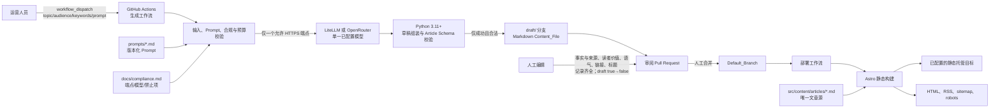

# Design Document：content-pipeline-skeleton

## Overview

（概览）

`content-pipeline-skeleton` 是一个**最低经济投入、人工审核后发布**的静态内容博客 MVP。本文档只依据同目录的 `requirements.md` 设计；未采用参考资料或外部架构方案，也不引入 VPS、Ollama、Redis、多平台代理、反检测、KDP 自动化或动态服务。

内容的唯一手写来源是 Git 仓库中带 YAML front-matter 的 Markdown `Content_File`。Astro 在构建时将 Markdown 编译为 HTML；HTML 是构建产物，绝不维护第二份手写文章 HTML。运营人员手动触发 GitHub Actions，Python 3.11+ 脚本通过 LiteLLM **或** OpenRouter 中恰好一个网关、恰好一个模型生成草稿。草稿只能进入 `draft/<sha256>` 非默认分支，必须经 Pull Request 人工审核、保留五项审核记录、将 `draft: true` 改为 `draft: false` 后合并；默认分支合并才触发静态部署。

### 目标

- 用 Astro 静态构建提供首页、文章、标签、归档、RSS、sitemap、robots、基础 SEO/OG 和 320–768 CSS 像素移动阅读体验。
- 用版本化 Prompt、受约束的手动输入、单模型生成、预算上限和最多一次暂时网络错误重试，形成低成本可审阅草稿。
- 用 Article Schema、路径安全、HTML 转义、草稿防御性过滤、最小 GitHub 权限、端点白名单和审阅闸门保证安全与可追溯。
- 将固定基础设施月成本目标设为 0（不含域名与按量 LLM API）；这是预算目标，不是 GitHub、Cloudflare 或其他供应商价格的承诺。

### 非目标

- 不提供数据库、Redis、Postgres、pgvector、任务队列、Prefect、VPS、Docker、Ollama、动态运行时或 CMS。
- 不提供登录、评论、支付、管理后台、公开写接口、自动发布、自动跨平台分发或第三方发布凭据。
- 不实现 AI 检测规避/humanizer、限流绕过、多账号、分散 IP、违反第三方条款的 UI 自动化或 Selenium。
- 不做 grounding、质量循环、自动改写、多模型路由或定时生成；`sources` 始终存在但可为空数组。

### 设计依据与研究范围

需求已明确限定技术栈、流程和边界，且要求 `requirements.md` 为唯一需求来源。因此本设计不进行外部产品、价格或参考书检索，也不将任何服务价格写成保证；未验证的供应商行为均通过集成测试或部署时配置审查处理。

## Architecture

（架构）

### 分层与边界

| 层 | 职责 | 允许的状态/网络 | 明确禁止 |
| --- | --- | --- | --- |
| 内容层 | Markdown、front-matter、Prompt、合规清单和 Git 历史 | Git 文件 | 数据库、第二份手写 HTML |
| 生成层 | 输入/配置检查、预算估算、单次模型生成、schema 校验和草稿变更 | 一个合规 HTTPS 网关；短暂工作流状态 | 多网关、多模型、自动质量循环、队列 |
| 审阅层 | PR 人工核验、审核记录、`draft` 状态变更与合并 | GitHub PR | 自动批准、自动合并、自动发布 |
| 发布层 | Astro 收集发布文章、生成静态资产、静态托管 | 构建和已配置托管目标 | 服务端文章运行时 |

生产页面中的文章集合由 `Production_Article_Set` 单一函数定义：**仅** schema 有效且 `draft` 为布尔 `false` 的文章。缺少 `draft`、非布尔 `draft` 或 `draft: true` 一律排除。这是生成层与发布层独立实施的纵深防御。

## Components and Interfaces

（组件与接口）

### 组件职责

| 组件 | 职责 | 输入 | 输出/失败 |
| --- | --- | --- | --- |
| Astro Content Loader | 从 `src/content/articles/` 读取 Markdown，解析并校验内容集合 | 文件树、Article Schema | `Production_Article_Set` 与草稿/非法项排除结果 |
| 页面与聚合构建器 | 生成首页、文章、标签、归档、RSS、sitemap、robots、SEO/OG | 发布集、站点 URL | 静态路由和构建产物 |
| Prompt_Store | 从 `prompts/*.md` 按 `name`+`version` 唯一读取 Prompt | 选定标识、Prompt 文件清单 | Prompt front-matter 和正文；缺失/重复/格式错失败 |
| 输入验证器 | 验证 dispatch 必填、Unicode 长度、`prompt_name` 与 semver | 五个工作流输入 | 规范化的有效请求；字段级失败 |
| Compliance Policy | 读取 `docs/compliance.md`，绑定端点、模型、调用次数与禁止项 | 配置、请求目标 | 仅允许的请求；拒绝未列白名单项 |
| Budget_Controller | 调用前估算成本，比较每篇与每次运行上限 | 单价、token 上限、已预留成本 | 允许/阻断；固定六位小数估算值 |
| Model_Gateway Adapter | 以唯一已选 LiteLLM 或 OpenRouter 端点调用唯一模型 | 合规请求、秘密凭据 | 原始模型结果或分类错误 |
| Draft Assembler / Schema Validator | 转义原始 HTML、填充固定字段、验证内容/路径/编码 | 模型结果、配置、请求 | 无 BOM UTF-8/LF 的合法草稿，或零 Git 变更的失败 |
| Git_Change_Manager | 计算稳定键、选择草稿分支和文件路径、创建/更新可审阅结果 | 合法草稿、规范化请求、模型 | 非默认分支 PR 或清晰创建说明 |
| Human_Editorial_Gate | 在 PR 中保存五项审核记录并控制发布状态 | Draft_Article、编辑确认 | 允许 `draft: false` 的人工合并变更 |
| Deployment_Pipeline | 默认分支合并后构建并向已配置静态目标发布 | 默认分支提交 | 新静态部署或失败状态（旧部署保留） |

### 关键接口契约

**GenerationRequest**：`topic`、`audience`、`keywords`、`prompt_name`、`prompt_version` 都必填。`topic`/`audience` 最大 160 个 Unicode 字符，`keywords` 最大 300；`prompt_name` 匹配 `^[a-z0-9]+(?:-[a-z0-9]+)*$` 且最长 64；`prompt_version` 匹配 `^[0-9]+\.[0-9]+\.[0-9]+$`。验证在任何模型调用前执行，失败日志指明字段名但不泄露秘密。

**Prompt 解析接口**：以 `(name, version)` 返回唯一文件的 YAML front-matter 与 Markdown 正文。文件不存在、缺 `name`/`version`、格式非法或出现相同键的两个文件时失败并给出路径或选定标识。

**GatewayRequest**：只包含已验证 Prompt、运营输入、配置模型标识和允许端点。运行开始时将网关枚举解析为 `litellm` 或 `openrouter` 中一个值，同时解析一个非空模型标识；两者均未配置、均配置或值不在合规清单时均失败。适配器不会接收可任意指定的 URL。

**GitChangeResult**：成功时必须指向 `draft/<stable-key>` 非默认分支，并返回 PR URL 或不依赖特定 GitHub API 的清晰 PR 创建说明。不能产生可审阅非默认分支结果即为整个工作流失败。

## Data Models

（内容数据模型）

### 文章路径与 front-matter schema

文章仅可位于配置的内容根目录（设计路径：`src/content/articles/`）下，文件名匹配 `^[a-z0-9][a-z0-9-]{0,99}\.md$`。验证器拒绝 `..` 路径段及解析后逃离内容根目录的路径。

| 字段 | 类型与约束 | 说明 |
| --- | --- | --- |
| `title` | 非空字符串 | 页面标题与 RSS 标题；输出 HTML 时转义 |
| `description` | 非空字符串 | 页面描述与 RSS 描述；输出 HTML 时转义 |
| `pubDate` | `YYYY-MM-DDTHH:mm:ssZ` | UTC 发布时间、排序主键 |
| `updatedDate` | 可选 UTC_Timestamp | 仅模型结果给出更新时间时写入 |
| `tags` | 字符串数组 | 标签归档来源；输出时转义 |
| `slug` | `^[a-z0-9]+(?:-[a-z0-9]+)*$`，1–80 字符 | URL 标识 |
| `draft` | 布尔值 | `true` 永不进入生产集；只 `false` 可发布 |
| `ai_assisted` | 布尔值 | 生成文章固定为 `true` |
| `model` | 非空字符串 | 固定为已配置的单一模型标识 |
| `prompt_version` | 非空字符串 | 固定为已选 Prompt_Version |
| `sources` | 数组，可为空 | 每项为 `title` 非空、HTTPS `url`、UTC `accessedDate` |

正文为非空 CommonMark，字符数不超过配置的最大值。正文链接只能是绝对 HTTPS URL 或以 `/` 开头的站内绝对路径。生成结果内的原始 HTML 先转义为文本；包含可执行 `script` 元素的内容文件被拒绝。写入规范固定为无 BOM UTF-8 和 LF 换行。

### 发布与 URL 模型

- `Canonical_URL` 由绝对 HTTPS 的 `Site_URL_Setting` 与发布路径生成；文章页、RSS 和 sitemap 使用同一个计算结果。
- 聚合页、RSS、sitemap 都只消费 `Production_Article_Set`，并以 `(pubDate DESC, Canonical_URL ASC)` 稳定排序。
- 空发布集仍产生有效首页、标签、归档、RSS 和 sitemap，但没有文章条目。
- Markdown 由 Astro 按 CommonMark 语义编译。标题层级、链接目标和归一化纯文本须保持对应语义；文章 HTML 不能含可执行脚本。

### 稳定草稿身份

稳定生成键计算前，将 `topic`、`audience`、`keywords` 做 NFC 规范化、去首尾空白并压缩内部空白，再以**明确分隔符**连同 Prompt_Version 和模型标识输入 SHA-256。由该键决定：

- 分支：`draft/<sha256>`；
- 文件：`src/content/articles/<slug>-<sha256 前 12 位>.md`。

同一稳定键始终选相同分支和路径；重跑仅更新既有文件或保持不变，绝不制造同草稿副本。目标文件字节内容不变时不创建提交。Prompt_Version 或模型标识变化产生独立稳定键与草稿变更。

## 关键流程

### 生成与创建审阅变更

1. 运营人员手动启动 `workflow_dispatch` 并提交五个输入。工作流不声明 `schedule`、push 或其他生成触发器。
2. 输入验证器检查必填、长度和格式；Prompt_Store 唯一解析版本化 Prompt；Compliance Policy 读取允许端点、指定模型、调用上限和禁止项。
3. 运行在调用前检查网关、单一模型和凭据存在，再检查所有预算配置存在。按下式以六位固定小数预估单次调用：`estimated_cost = (max_input_tokens × input_unit_price + max_output_tokens × output_unit_price) / 1,000,000`。若预估超过单篇上限，或加本次已预留成本超过单次工作流上限，则终止且零模型调用。
4. Model_Gateway Adapter 只向合规清单中唯一的 HTTPS 端点，以指定模型发出一次请求。成功后不进行二次写作、质量循环或路由。
5. Draft Assembler 写入所需 front-matter；强制 `draft: true`、`ai_assisted: true`、已配置模型和已选 Prompt_Version，并始终写入 `sources`（没有来源即 `[]`）。完成转义、schema、链接、路径、正文和编码验证。
6. 任一 Article Schema 失败均停止，报告字段或链接位置，且**不创建也不改动**任何草稿 Git 变更。
7. 仅合法结果进入 Git_Change_Manager，按稳定键创建或更新非默认分支内容，并产生 PR 或明确 PR 创建说明；无法产生可审阅结果时工作流失败。

### 审阅与发布

1. 编辑者在 PR 内逐项审阅并记录：**事实与来源、读者价值、语气、链接、标题**。
2. 五项记录齐全后，编辑者手动将目标文章 `draft` 从 `true` 改为布尔 `false`；只有该 PR 的人工合并可进入 Default_Branch。
3. Default_Branch 合并触发 Deployment_Pipeline。Astro 再次应用生产集防御性过滤，构建 HTML 和所有发现资产，然后部署到已配置静态托管目标。
4. 若生产构建失败，部署以失败结束，静态托管目标继续保留本次构建开始前可访问的部署。生成工作流从不触发部署或直接发布。

### 失败、重试与幂等

- 缺输入、无效 Prompt、重复 Prompt、缺配置、超预算、非白名单端点、非指定模型、schema 失败、路径不安全或无法创建审阅结果：立即失败且不做无关副作用。
- 首次调用出现连接超时、连接中断、HTTP 429 或 HTTP 5xx 时，最多重试一次。若 HTTP 429 含 `Retry-After`，只等待其指定时长后重试；其他可重试错误使用唯一一次重试策略。
- 其他 HTTP 4xx、响应解析错误和 Article Schema 错误不可重试。任何运行调用模型两次后必定终止，不发起第三次调用。
- 相同稳定请求重复运行落到同一分支和同一文件；内容相同不会新增提交，避免重复草稿。

## 配置、秘密与权限

### 版本化配置

| 配置域 | 必需内容 | 约束 |
| --- | --- | --- |
| 站点 | `Site_URL_Setting` | 绝对 HTTPS 根 URL；用于 canonical 与 robots sitemap 指令 |
| 内容 | 内容根目录、正文最大字符数 | 仅允许文章根下安全 Markdown 路径 |
| Prompt | `prompts/*.md` 的 `name`、语义化 `version`、正文 | `(name, version)` 必须唯一 |
| 网关 | 网关枚举、唯一模型标识、允许端点 | LiteLLM 或 OpenRouter 二选一；端点和模型必须在清单中 |
| 预算 | 输入/输出每百万 token 单价、最大输入/输出 token、单篇/单次上限 | 任一缺失即调用前失败 |
| 合规 | 允许端点、模型、调用上限、审阅要求、禁止依赖/凭据/能力 | 存于 `docs/compliance.md`，可审查、可版本化 |

### 秘密与最小权限

- API 密钥仅作为 GitHub Actions secret 注入调用步骤；不得写入仓库、草稿、PR 正文、构建产物或日志。日志使用字段名、状态和已遮蔽标识，不记录完整密钥。
- 工作流令牌只允许向本工作流创建/选定的 `draft/<sha256>` 内容分支写入，以及在采用自动 PR 时创建 PR 所需的最小权限。配置以最小 `contents`/`pull-requests` 权限实现，并用默认分支保护规则作为强制防线。
- Workflow_Token 不获得默认分支写入、PR 合并或 PR 批准权限；生成脚本在逻辑上也拒绝默认分支目标。
- 生成工作流不持有第三方内容发布凭据。部署凭据仅属于已配置静态托管部署边界，不能被生成步骤读取。
- 合规策略在实际网络调用前进行精确端点白名单检查；任何未列 HTTPS 端点立即失败。DNS、重定向和客户端配置也不得把请求逃逸到另一端点。

## Error Handling

（错误处理与安全）

| 威胁或故障 | 预防/处理 | 不变量 |
| --- | --- | --- |
| 草稿误发布 | 生成时强制 `draft: true`；构建时排除缺失/非法/true draft；PR 人工改为 false | 只有有效 `draft: false` 可进入生产集 |
| 恶意 HTML / script | 原始 HTML 转义；schema 拒绝可执行 script；输出元数据转义 | 页面不输出可执行文章脚本 |
| 路径逃逸或覆写 | 内容根限制、文件名规则、拒绝 `..` 与解析后越界路径 | 生成仅写允许文章目录 |
| 非法链接/来源 | 正文仅 HTTPS 或站内 `/`；Source_Item 限 HTTPS+UTC | 外链与来源格式可审计 |
| 预算失控 | 调用前固定精度预算检查；一次运行上限；最多两次调用 | 超预算时 gateway 零调用 |
| 无限/错误重试 | 只定义的网络错误可重试一次；非重试错误立即结束 | 每运行模型调用数 ≤ 2 |
| 密钥泄露 | secret 注入、日志脱敏、无持久化写入 | 日志不含 API 密钥完整值 |
| 权限扩大 | 非默认分支约束、默认分支保护、最小令牌、人工合并 | 生成工作流不能直接发布 |
| 内容质量或合规漂移 | 人工五项审阅、Prompt 与清单版本化、禁止项明确记录 | 审阅记录可随 PR 追溯 |

`docs/compliance.md` 是实现时必须建立和持续维护的清单。它至少列出：允许 HTTPS 网络端点、指定模型、每运行模型调用上限、五项人工审核要求、禁止依赖、禁止持有的第三方发布凭据，以及禁止能力（检测规避、humanizer、限流绕过、多账号、分散 IP、违规 UI 自动化/Selenium、未审阅大规模分发和自动跨平台分发）。

## 部署与静态输出

Deployment_Pipeline 只在 Default_Branch 接收已合并内容变更后运行，执行 Astro 的可重复静态构建并发布至预先配置的静态托管目标。部署目标可由项目维护者选择，但本设计不假定或承诺 GitHub、Cloudflare 或任何服务的免费额度、可用性或价格。

构建输出及规则：

- 首页、文章页、标签页、归档页；所有聚合面只使用排序后的 `Production_Article_Set`。
- `/rss.xml` 为 RSS 2.0；每篇包含标题、描述、`pubDate` 和 Canonical_URL。
- `/sitemap.xml` 为 XML Sitemap，只含发布文章 Canonical_URL。
- `/robots.txt` 的 `Sitemap` 指令指向 `Site_URL_Setting` 确定的 `/sitemap.xml`。
- 每个发布文章页包含 title、description、发布日期、canonical 和 Open Graph 元数据；所有来自内容的元数据在 HTML 输出时转义。
- 响应式样式在 320–768 CSS 像素确保正文、标题和链接可见，正文不需水平滚动；标签链接支持键盘聚焦与 Enter 激活。

## Correctness Properties

*性质（property）是指在系统所有有效执行中都应成立的特征或行为——即对系统应做什么的形式化陈述。它连接人类可读需求与可由机器验证的正确性保证。*

### 属性反思与合并

已基于全部验收标准完成测试预分析。为避免重复，以下合并了：（1）Article Schema、HTML 转义和零 Git 写入失败路径；（2）所有聚合面的发布过滤、排序与空集；（3）输入、Prompt、配置与日志调用前防线；（4）稳定键、分支/路径和提交幂等；（5）预算、Retry-After 与两次调用上限；（6）草稿过滤、审核记录、发布闸门和合规端点。这样每项性质覆盖独立行为而不重复断言其子条件。

### Property 1: 文章 schema、安全写入与 Markdown 语义

**For any（对于任意）** front-matter、来源、路径、文件名和 Markdown 正文输入，系统当且仅当所有字段类型、UTC 时间、Slug、来源结构、路径边界、正文长度、链接格式、UTF-8/LF 编码及脚本限制都有效时接受 Content_File；任一无效项均不会产生 Git 草稿变更。对于任意可接受 Markdown，原始 HTML 会以文本形式出现，编译产物不含可执行 script，且标题层级序列、链接目标序列与折叠连续空白后的纯文本分别保持与 Markdown 的对应关系。

**Validates: Requirements 1.1**

**覆盖范围：Requirements 1.4、4.1–4.12、8.1–8.5、8.7、8.8**

### Property 2: 生产集合、发现资产与 canonical 一致性

**For any（对于任意）** 有效、缺失或非法 `draft` 值混合的文章集合，首页、标签页、归档、RSS 与 sitemap 都只包含 `draft: false` 且 schema 有效的文章；输出以 `pubDate` 降序、同日期以 Canonical_URL 升序排序；空生产集合不含文章项。对于任意发布文章和合法 Site_URL_Setting，文章页、RSS 与 sitemap 使用同一绝对 HTTPS Canonical_URL，RSS 条目保留标题、描述和 pubDate，robots 的 Sitemap 指向该站点的 sitemap。

**Validates: Requirements 2.2**

**覆盖范围：Requirements 2.3–2.8、7.2、8.6**

### Property 3: 调用前输入、Prompt、网关配置与秘密防线

**For any（对于任意）** 工作流输入、Prompt 清单和网关配置，任何空值、长度越界、格式错误、无效/缺失 Prompt、重复 `(name, version)`、缺失单一网关/模型/凭据或不在白名单的模型/端点，都会在调用 Model_Gateway 前失败；任意有效选定标识唯一解析到一个 Prompt。对于任意秘密值，产生的日志均不包含该秘密完整值。

**Validates: Requirements 3.1**

**覆盖范围：Requirements 3.2–3.10、3.13、9.3、9.4**

### Property 4: 稳定生成身份与幂等草稿变更

**For any（对于任意）** 经 NFC 规范化、去首尾空白并压缩内部空白后的相同 `topic`、`audience`、`keywords`、Prompt_Version 和模型标识，稳定生成键、`draft/<key>` 分支及 `<slug>-<key 前12位>.md` 路径保持确定；重复执行不会增加表示相同草稿的文件，目标内容相同不会增加提交。对于任意仅 Prompt_Version 或模型标识改变的有效请求，生成独立稳定键与草稿目标。

**Validates: Requirements 5.1**

**覆盖范围：Requirements 5.2–5.6**

### Property 5: 预算和受限重试状态机

**For any（对于任意）** 非负单价、token 上限、预算上限、预留成本和模型错误序列，系统按规定公式以六位固定小数预估费用；缺失预算配置、单篇超限或累计超限时绝不调用网关。只有首次调用的连接超时、连接中断、HTTP 429 或 HTTP 5xx 能引发唯一一次额外调用；带 `Retry-After` 的 429 使用该等待值，其他 HTTP 4xx、解析错误和 schema 错误不重试，任意运行总调用数不超过两次，成功校验后不再生成内容或路由其他模型。

**Validates: Requirements 6.1**

**覆盖范围：Requirements 6.2–6.12、9.6**

### Property 6: 草稿、审核、权限和合规发布闸门

**For any（对于任意）** 有效生成结果和生成/审阅事件序列，生成文章均为 `draft: true`；只有保留事实与来源、读者价值、语气、链接、标题五项审核记录并人工将 `draft` 改为 `false` 的文章可进入发布路径。任意模型调用轨迹只使用清单指定端点和模型，不直接写入 Default_Branch、不合并或批准 PR，也不会自动发布。

**Validates: Requirements 5.8**

**覆盖范围：Requirements 5.9–5.10、7.1–7.6、9.2–9.7**

## Testing Strategy

（测试策略）

### 测试分层与工具选择

测试同时采用示例/集成测试与属性测试。属性测试适用于本项目可隔离的纯逻辑、转换和内存替身；外部 GitHub、托管及真实 API 不被重复随机调用。Python 生成层使用 **Hypothesis**；Astro/TypeScript 侧的内容集合、排序及渲染纯函数使用 **fast-check**。每个上述属性恰好由一个对应的属性测试实现，至少运行 100 次，并带可检索注释：`Feature: content-pipeline-skeleton, Property N: <性质标题>`。

| 层级 | 覆盖重点 | 边界 |
| --- | --- | --- |
| 属性测试 | 属性 1–6 的 schema、集合、排序、URL、输入、Prompt、稳定键、预算、重试状态机、端点/审核事件模型 | 使用文件系统、Git 和 gateway 的内存替身；不调用真实外部服务 |
| 单元/示例测试 | 路由存在、空发布集、键盘标签操作、固定 front-matter、非法 script、边界 Unicode 长度、PR 审核模板 | 覆盖可读的具体案例和属性生成器的重要边界 |
| 构建与浏览器测试 | Astro 产物、RSS 2.0/XML、sitemap、robots、SEO/OG、320/768 布局和无横向滚动 | 在隔离构建产物上运行，不需要动态服务 |
| GitHub 集成/配置审查 | `workflow_dispatch` 唯一触发、Python 3.11+、唯一网关/模型、最小令牌、分支保护、非默认 PR 结果 | 以沙箱仓库、workflow lint 和权限审查验证；不假设平台价格 |
| 部署集成 | 默认分支合并触发构建发布；失败构建保留既有部署 | 1–3 个代表性部署，不使用 PBT |
| Gateway 集成 | 单一允许端点、模型配置、429 Retry-After 映射 | HTTP mock/沙箱凭据；真实 API 调用尽量少且有预算保护 |

PBT 生成器必须包含：Unicode NFC 与空白等价输入、UTC 时间、同日 canonical 决胜、空/非法 sources、路径穿越、特殊字符元数据、原始 HTML、有效和无效链接、成本边界与所有错误类别。测试中不得打印秘密或真实模型响应中的敏感数据。

### 验收与回归

- 每次修改内容 schema、生成逻辑或 Astro 集合逻辑，运行相关单元测试与全部属性测试（每性质至少 100 次）。
- 每次修改工作流、权限、合规清单或部署配置，执行 workflow 静态检查、配置审查和代表性集成测试。
- 发布前构建完整静态站点，验证草稿在所有页面、RSS 和 sitemap 中不可见。
- 生产构建失败测试必须确认上一已部署版本仍可访问；这属于部署集成边界，而非属性测试。

## 可观察性与审计

不部署日志服务器、指标数据库或错误跟踪平台。以 GitHub Actions 运行摘要、受脱敏保护的步骤日志、PR、Git 提交和版本化文件作为 MVP 审计记录。

每次运行可记录：运行标识、已验证输入字段名（非秘密内容可按最小需要摘要）、Prompt 名称/版本、模型标识、稳定键摘要、预算预估/是否被拒绝、调用次数、重试类别、schema 失败字段、草稿分支/PR 说明和最终状态。不得记录 API 密钥完整值。PR 则是人工审核五项记录与 `draft` 状态转换的永久审计面。

## 延后演进

以下服务不在 MVP 依赖图中，且只能在对应触发条件成立并由维护者显式决定后评估；引入时必须重新定义数据、权限、成本、隐私和测试边界：

| 后续能力 | 仅在以下条件后评估 |
| --- | --- |
| 每周定时生成 1–2 篇 | 人工确认审阅能力稳定，并显式启用定时工作流 |
| Tally | 已上线且需要选题或反馈表单 |
| PostHog | 已有发布内容和真实访问，需要阅读/外链分析 |
| Resend | 有合法订阅者并已建立确认订阅流程 |
| Cloudflare Worker + Turnstile | 需要自建公开写接口 |
| D1 或 Supabase（二选一） | 需要持久化表单、订阅者或用户数据 |
| Upstash Redis | 公开 API 出现滥用或需要限流 |
| Sentry | 出现动态后端或复杂客户端故障且需要观测 |

这些条件不自动触发任何实施。特别是 D1/Supabase、Upstash 与 Worker 均不属于当前静态内容闭环。

## 需求可追溯性

| 需求 | 设计落点 | 验证方式 |
| --- | --- | --- |
| 1 静态与成本 | 概览、架构分层、部署与静态输出 | 构建/部署集成、配置审查 |
| 2 阅读发现 | 发布 URL 模型、部署输出、属性 2 | PBT、构建/浏览器测试 |
| 3 手动生成与 Prompt | 组件接口、生成流程、配置秘密、属性 3 | PBT、workflow 审查 |
| 4 草稿 schema | 内容模型、生成流程、属性 1 | PBT、单元测试 |
| 5 Git 稳定性/权限 | 稳定草稿身份、权限、属性 4/6 | PBT、GitHub 集成审查 |
| 6 预算与重试 | 生成流程、错误安全、属性 5 | PBT、HTTP mock 集成 |
| 7 人工发布闸门 | 架构、审阅发布、错误安全、属性 2/6 | PBT、PR/权限集成 |
| 8 编译与 SEO | 内容模型、部署输出、属性 1/2 | PBT、静态构建测试 |
| 9 合规读者价值 | 合规配置、安全、属性 3/5/6、审阅 | PBT、人工/配置审查 |
| 延后范围 | 非目标与延后演进 | 架构/依赖审查 |
